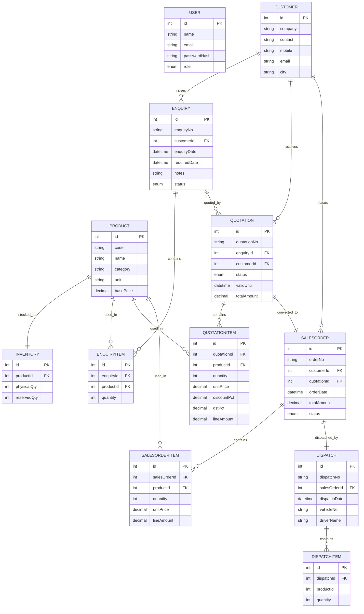

# ER Diagram - Manufacturing Sales & Inventory Management System

## Relationship overview

```
User (login only, no business FK)

Customer  1 ----- N  Enquiry
Customer  1 ----- N  Quotation
Customer  1 ----- N  SalesOrder

Enquiry   1 ----- N  EnquiryItem     N ----- 1  Product
Enquiry   1 ----- N  Quotation       (optional reference)

Quotation 1 ----- N  QuotationItem   N ----- 1  Product
Quotation 1 ----- 1  SalesOrder      (unique -> no duplicate conversion)

SalesOrder 1 ---- N  SalesOrderItem  N ----- 1  Product
SalesOrder 1 ---- 1  Dispatch        (unique -> no duplicate dispatch)

Dispatch  1 ----- N  DispatchItem

Product   1 ----- 1  Inventory       (physicalQty, reservedQty)
```

## Mermaid diagram



## Key constraints

| Constraint | Purpose |
|---|---|
| `User.email` unique | one account per email |
| `Product.code` unique | unique product code |
| `Inventory.productId` unique | one stock row per product |
| `Enquiry.enquiryNo`, `Quotation.quotationNo`, `SalesOrder.orderNo`, `Dispatch.dispatchNo` unique | unique document numbers |
| `SalesOrder.quotationId` unique | a quotation can be converted only once |
| `Dispatch.salesOrderId` unique | an order can be dispatched only once |
| `physicalQty >= reservedQty` (validated in backend) | available quantity can never go negative |

## Status fields

| Model | Statuses |
|---|---|
| User.role | ADMIN, SALES_USER |
| Enquiry.status | NEW, QUOTED, WON, LOST |
| Quotation.status | DRAFT, SENT, ACCEPTED, REJECTED |
| SalesOrder.status | PENDING, CONFIRMED, DISPATCHED, CANCELLED |
